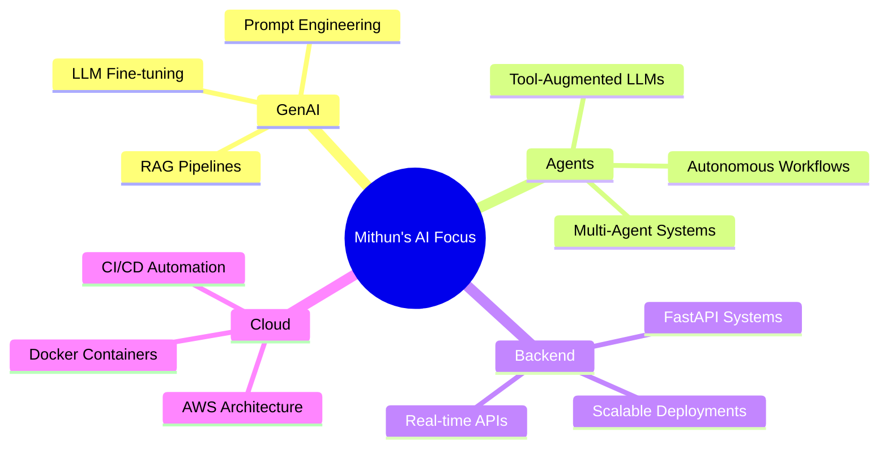

<div align="center">

<!-- Animated Header Banner -->


</div>

<div align="center">

[](https://git.io/typing-svg)

</div>

---

<table align="center" border="0">
<tr>
<td width="55%" valign="top">

## 🧠 Who Am I?

```python
class MMithun:
    name       = "M Mithun"
    role       = "AI & Data Science Undergraduate"
    college    = "Sri Eshwar College of Engineering"
    location   = "Tamil Nadu, India 🇮🇳"

    focus = [
        "Generative AI & LLMs",
        "Agentic AI Systems",
        "ML Engineering",
        "Backend & API Design",
    ]

    currently_building = "Production-Ready AI Systems"
    fun_fact = "I automate everything I touch ⚡"

    def mission(self):
        return "Turn models into real-world impact 🚀"
```

</td>
<td width="45%" align="center" valign="top">

<br/>


<br/><br/>

[](https://www.linkedin.com/in/m-mithun-85787628b/)
[](https://github.com/Mithun017)
[](mailto:mmithun1701@gmail.com)

</td>
</tr>
</table>

---

## 🚀 My AI Engineering Spectrum

<div align="center">

```
╔══════════════════════════════════════════════════════════════════════╗
║                    ◈  FULL-STACK AI PIPELINE  ◈                     ║
╠══════════╦══════════════╦═════════════╦═════════════╦═══════════════╣
║  DATA    ║   MODELS     ║  INFERENCE  ║    APIs     ║  DEPLOYMENT   ║
║──────────║──────────────║─────────────║─────────────║───────────────║
║ GeoPandas║ Transformers ║  LangChain  ║   FastAPI   ║    Docker     ║
║  NLTK    ║ CNN/RNN/LSTM ║   RAG/Eval  ║  REST APIs  ║    AWS EC2    ║
║  ARIMA   ║ LLM Fine-tune║ AI Agents   ║  Streaming  ║  CI/CD Pipes  ║
╚══════════╩══════════════╩═════════════╩═════════════╩═══════════════╝
```

</div>

---

## 🧰 Tech Arsenal

<div align="center">

### 🤖 AI / ML / GenAI


### 💻 Languages


### ⚙️ Backend & Infra


</div>

---

## 📊 Expertise Radar

<div align="center">

| Domain | Expertise | Level |
|---|---|---|
| 🧠 Generative AI & LLMs | `█████████░` | Advanced |
| 🤖 Agentic AI & RAG | `████████░░` | Advanced |
| 🔬 Deep Learning (CNN/RNN/Transformers) | `████████░░` | Advanced |
| ⚡ Backend APIs (FastAPI) | `████████░░` | Advanced |
| ☁️ Cloud & DevOps (AWS/Docker) | `██████░░░░` | Intermediate |
| 📈 Time Series & Predictive Analytics | `███████░░░` | Advanced |
| 🔊 Audio & Signal Analysis | `██████░░░░` | Intermediate |

</div>

---

## 📈 GitHub Intelligence Dashboard

<div align="center">


</div>

<div align="center">


</div>

<div align="center">


</div>

---

## 🏆 Achievements & Trophies

<div align="center">


</div>

---

## 👑 Leadership & Recognition

<div align="center">

| 🏅 Role | 🏢 Organization |
|---|---|
| 🎯 **Vice-President** | IETE Student Forum |
| 🌐 **Campus Ambassador** | IIT PALS Program |
| 📄 **Published Author** | IEEE |

</div>

---

## 🎯 Current Focus



---

<div align="center">

### 💬 Philosophy

> *"Don't just study AI — build with it. Every model should solve a real problem."*
> 
> — **M Mithun**

<br/>

[](https://github.com/Mithun017?tab=repositories)

<br/>

**⭐ If my work helps you — a star means everything! Let's connect and build something impactful together.**

<br/>


</div>


